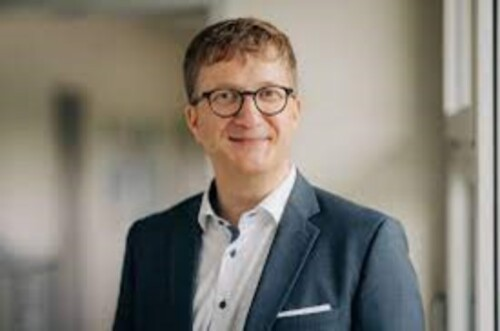

+++
title = "Auf der Spur des Übersinnlichen"
date = "2024-04-23"
draft = false
pinned = false
+++
# Unterwegs mit den Ghosthunters

Spukgestalten und Geisterjäger*innen kennt man aus bekannten Horrorfilmen wie Conjuring und Ghostbusters. Angsteinflössende Gestalten die Menschen heimsuchen, diese quälen und so um den Verstand bringen. Doch was hat es auf sich mit diesen Geistern? Gibt es sie wirklich? Oder ist die Gestalt, die mich jede Nacht aus der dunklen Zimmerecke beobachtet doch nur der Schatten meines Kleiderhaufens auf dem Schreibtischstuhl?

\
*Eine Reportage von Linda Jakob und Luna Petitmermet, 26. April. 2024*

*März 2024…*

Die Sonne ist bereits verschwunden und ein eisiger Windzug zieht um die Wohnblocks von Safenwil. Das Summen der Eingangstür ist das einzige Geräusch, das die Abendstille durchbricht. Eine feine Duftnote Weihrauch hängt in der Luft des Eingangsbereichs, die mit jedem Stufenstritt stärker wird. Die Quelle des orientalischen Duftes ist die Wohnungstür von Thomas Frei. Hinter der Wohnungstür versteckt sich eine gründlich ausgeräucherte, von sakralen Gegenständen und Ghostbustersfanartikeln übersähte Wohnung. Nach 15 Minuten warten, in denen Herr Frei ruhelos hinter verschiedenen Türen verschwindet, um letzte Telefonate zu führen, beginnt die Reise in die Welt des Paranormalen. 

")

## Geboren als Medium

«Also, angefangen hat es im Kindesalter mit 4 Jahren» leitet Thomas Frei ein, er habe schon damals unbewusst mit Elementarwesen Kontakt aufgenommen. Sie hätten Ähnlichkeiten mit dem Gollum aus Herr der Ringe gehabt. Ungefähr drei Jahre später begann der Kontakt zu verstorbenen Kindern, der ging über zum Kontakt mit Erwachsenen bis hin zum Vorhersehen von Geschehnissen. 



## Thomas Frei

Thomas Frei war als diplomierter Krankenpfleger tätig und wurde mit dem Erwachsenwerden zum Spiritualisten. Er hat anschliessend die Ausbildung zum Komplementärmediziner absolviert und nebenbei Hypnosetherapeut, Reikimeister und weiterführende therapeutische Ausbildungen abgeschlossen. Heute ist Thomas Frei als Ghosthunter tätig und führt medizinische Telefonate durch, ein kostenloser Service, um Menschen in medizinischen Fragen zu beraten und allenfalls zur Notfallnummer weiterzuleiten.

## Die Arbeit als Ghosthunter*in

Die ehrenamtliche Arbeit, die man im Ghosthunterverein leisten kann, muss mit einer Ausbildung zum/zur Ghosthunter\*in eingeleitet werden. In der Ausbildung werden die Grundlagen gelernt, um Paranormales zu verstehen und deuten zu können. Es gibt im Verein verschiedene Gruppen an Helfer\*innen, die in Einsatz gehen dürfen. Für einen Einsatz müsse aber immer mindestens ein sogenanntes Elitemitglied dabei sein, welches schon viel Erfahrungen habe und die Vereinsmitglieder unterstützen könne. 
Der Verein arbeitet mit einer Universität aus Freiburg zusammen, um Substanzen und Beweismaterial zu untersuchen. Der Verein und das gesamte Denken von Thomas Frei und den Menschen, die in dem Bereich der Paranormalität arbeiten, wird stark von der Wissenschaft in Frage gestellt. Die Wissenschaft erkenne nichts an, was nicht bewiesen werden könne. Mit dokumentierten Experimenten und Beobachtungen, versuche Frei wie die Wissenschaft, Phänomene zu wiederholen damit man seine Arbeit ernst nehme. 
Der Ghosthunterverein sei leider auch für kriminelle Energien verlockend. Menschen, die das Vertrauen der Kund\*innen missbrauchen wollen. Herr Frei erklärt, es sei sehr oft so, dass Kund\*innen bei einem Einsatz oft nicht anwesend sein wollen und ihnen dann einen Hausschlüssel überliessen, bis die Arbeit getan sei. Das könne bei einigen zu unprofessionellen Gedanken führen. Herr Frei habe deswegen auch schon Mitarbeitende aus dem Verein ausschliessen müssen. Leider hätten sich diese Menschen dann zu einer eigenen Organisation zusammengeschlossen und seien jetzt auch als «Ghosthunters» unterwegs. Es sei daher sehr wichtig, dass man als hilfesuchende Person nicht auf diese Organisation reinfällt. 

Jede*r, der im Ghosthunterverein arbeite, habe daher einen Ausweis, der die Zugehörigkeit zum Verein bestätige. 
Die Ausbildung zum Ghosthunter kann jede Person machen, es sei jeder Mensch fähig, sich mit diesem Themenbereich auseinanderzusetzen.

## Mit dem Tod zum Geist?

«Was ist der Tod?» Thomas Frei nimmt Stift und Blatt zur Hand, zeichnet ein Strichmenschlein, das von einem schimmernden Kreis, der die Aura symbolisieren soll, umgeben ist. Er streicht es durch und zeichnet einen neuen Strichmenschen. Nun skizziert er die Aura neben das Strichmenschchen. «Wenn du bei Google Aura eingibst, heisst es immer: Ach ja, der Körper ist in der Aura oder die Seele ist um den Körper oder im Körper… doch das ist falsch!», sagt Frei dezidiert.
Er erklärt, dass zwei Energien in einem geschlossenen Raum einen Kurzschluss ergäben. Diese Aussage sei auf physikalische Gesetze zurückzuführen, in denen man von zwei gegensätzlichen Polen ausgehe. In diesem Fall seien die beiden Polen der Körper und die Aura in der menschlichen Hülle als geschlossener Raum, diese Gegensätze lösen bei einer direkten Verbindung einen Kurzschluss aus. Zusammenfassend sei es also so, dass der Körper grobstofflich und die Aura feinstofflichen sei und somit zwei getrennte Energien. Charakter und all unsere Eigenschaften seien im Feinstofflichen Teil abgespeichert, eine unendliche Energie, die nach dem Tod nicht einfach verschwinde. Diesen Teil brauche man, um in alle Formen der menschlichen Kommunikation zu gehen. Das Grobstoffliche sei alles, was man sehen könne, der Körper. 
Bei dem Sterbeprozess trennten sich diese beiden Energien voneinander, der Körper vergehe, aber das Feinstoffliche bleibe als Energie auf unserem Planeten zurück. Der Planet Erde sei auch eine grosse Energie und alles, was auf der Erde existiere und lebe, sei Energie, die nicht einfach verloren gehen könne. 

BILD

/«Wir waren schon und werden immer sein»
Herr Prof. Dr. med. Walther, aus dem Gebiet der Psychiatrie und Psychotherapie widerspricht dieser Aussage jedoch: Unser Körper und unsere Seele sei eine Energie und werde nicht in zwei Bereiche aufgeteilt. Es können zwar seelische Funktionen gemessen werden, doch nicht die Seele selbst es sei etwas, das von der Wissenschaft nicht erfasst werden könne. Daher sei es nicht möglich, dass sie weiterexistiere. Bei einem Sterbeprozess entfliehe die Energie eines Körpers durch die Ausstrahlung von Wärme.

Herr Prof. Dr. med. Walther von der Universitätsklinik für Psychiatrie und Psychotherapie der UPD gibt aus seiner Position eine wissenschaftlich basierte Sicht auf das Thema der Paranormalität. Der Schwerpunkt seiner Arbeit ist die Erforschung motorischer Störungen bei psychischen Erkrankungen. Der Patient*innen die er behandelt, haben eine ganze Reihe an Auffälligkeiten die dazu führen dass sie auch in der nonverbalen Kommunikation falsch verstanden werden. Die Betroffenen nehmen beispielsweise komische Körperhaltungen ein oder können nicht richtig gestikulieren.

## «Wir haben alle 10 Sinne»

Laut Freis Theorien seien alle Menschen mit 10 Sinnen geboren, die während dem Entwicklungsprozess von Kindern zu Jugendlichen durch die Sozialisierung unserer Gesellschaft oft verloren gehen würden. Wie bekannt haben wir Menschen den Tast-, Seh-, Riech- und Geschmackssinn. Die erweiterten 5 Sinne seien die sogenannten hellen Sinne, die Grundsinne in verschärfter. Durch diese hellen Sinne hätten wir das Gespür für Übernatürliches. 
«Ein Medium ist kein spezieller Mensch», meint Herr Frei, ein Medium welches sage, es habe spezielle Fähigkeiten das lüge schlicht und einfach. Medien hätten einfach diese hellen Sinne präsent, die der Mainstreammensch gar nicht für existent halte. Eine Person, die sich als Medium bezeichne, sei imstande Botschaften vom Übersinnlichen zu erhalten und so eine Kommunikation zwischen Energien und Mensch herzustellen, dies verliefe ausschliesslich über die hellen Sinne.

## Verschiedene Theorien, verschiedene Meinungen

Herr Walther meine, dass sonderbare Geräusche, ungewöhnliche Vorkommnisse und Eindrücke nicht auf Paranormalität geschoben werden könne. Für Paranormales gebe es keine Beweise, doch es sei bekannt, dass Phänomene wie diese im Gehirn und der Interaktion zwischen dem Gehirn und dem Körper entstehen. Erkenntnisse wie diese wurden in den letzten 20-30 Jahren gemacht, als man begonnen habe Gehirnfunktionen am Lebenden zu messen. Die psychische Energie und alles, was dazugehöre wie zum Beispiel das Denken oder auch die Entwicklung der Identität seien noch nicht komplett erforscht und verstanden, doch es sei auf jeden Fall sicher, dass sonderartige Wahrnehmungen im Gehirn stattfänden. 
/«Emotionale Kurzschlüsse, die uns das vorgaukeln»
Menschen, die Übersinnliches wahrnehmen bilden sich dies oft nur ein und seien selten von einer psychischen Krankheit betroffen. Die Schwierigkeit sei es, zu separieren und interpretieren, welche der Patient*innen nun so eine Illusion oder einen Sinneseindruck erfahren. Rund 5 Prozent der Weltbevölkerung seien grundsätzlich gesund, haben aber Illusionen, was nicht automatisch bedeutet, dass sie auf Hilfe angewiesen seien. Laut Professor Walther leiden nur ungefähr 1 Prozent der Weltbevölkerung an der psychischen Erkrankung Schizophrenie, die das Denken und die Gefühlswelt von den Betroffenen störe. Sie kann auch zu Realitätsverlusten und Wahrnehmungstäuschungen führen. Symptome von Schizophrenie sind Veränderung im Verhalten und Denken oder Verlust der Funktionsfähigkeit.
Thomas Frei sieht diese Momente, in denen Menschen Sinneseindrücke durchleben, als Anwesenheiten von übernatürlichen Energien. Diese Anwesenheit von Energien sei etwas Natürliches, wir nähmen sie nur oft nicht wahr und wenn dann als etwas Gefährliches. Unbekannte Geräusche, Gegenstände, die selbstständig ihren Standort verändern und Stimmen zu hören, die nicht da sein sollten sei völlig normal könne aber natürlich erschreckend sein, wenn man keine Erfahrung damit habe und Energien als böse und unerwünscht sehe. 
/«Wir sind alle Eins.»
Wenn die Gestalt aus deiner Zimmerecke dir das nächste Mal einen Schrecken einjagt, so versuche doch ein paar Worte mit ihr zu wechseln. Vielleicht erfährst du wieso sie dich jede Nacht besuchen kommt und wenn du keine Antwort erhältst so räume endlich deinen Kleiderhaufen vom Schreibtischstuhl weg!